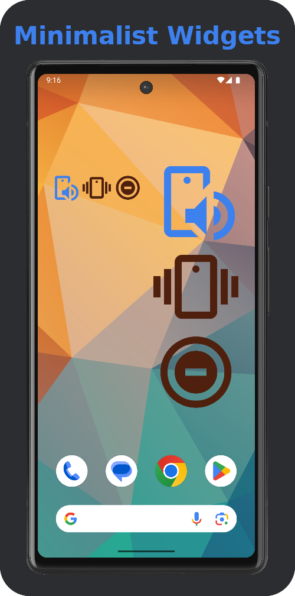
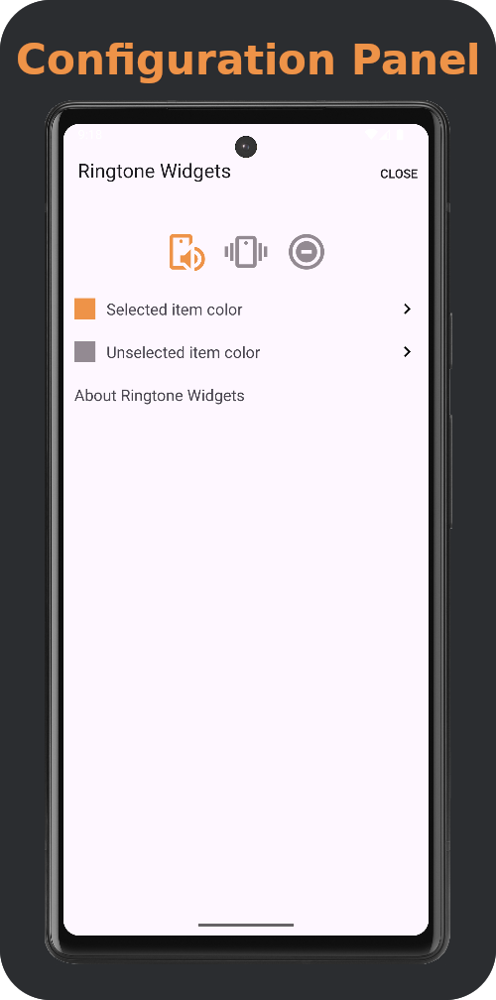
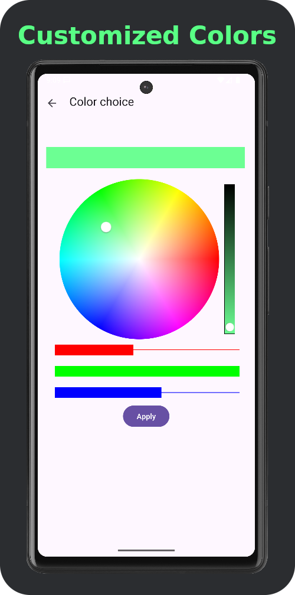

  

# Ringtone Widgets

**Ringtone Widgets** is a minimalist Android app that provides quick home-screen widgets to switch between **Ringer**, **Vibrate**, and **Silent** modes.  

The app is designed to be **privacy-friendly**:  
- No data collection  
- No analytics  
- No ads  
- Requires only **Do Not Disturb (DND) access** due to Android restrictions on ringer mode control  

  
  

## Features

- Lightweight and minimalist widgets (1x2 and 2x1)  
- Three buttons:  
  - Ringer  
  - Vibrate  
  - Silent (mapped to *Do Not Disturb* depending on Android version)  
- Color customization for widget icons  
- English and French localization so far
- Open-source, no background services  

## Limitations

Due to Android system restrictions:  

- The **true “silent” mode** available in the system volume panel is not accessible programmatically. Widgets use *Do Not Disturb (DND)* as a fallback.  
- Widget state does **not automatically update** if the ringer mode is changed elsewhere (e.g., hardware volume buttons).  

These behaviors are **expected and normal**.  

## Screenshots

## Permissions

- **Do Not Disturb Access (ACCESS_NOTIFICATION_POLICY)**  
  - Required to modify the ringer mode through the widgets  
  - No other permissions are used  

## Contributing

Contributions are welcome!

* Fork this repository
* Make your changes
* Open a Pull Request

👉 Repository: [https://github.com/dleprovost/ringtone-widgets](https://github.com/dleprovost/ringtone-widgets)

## License

This project is licensed under the **GNU General Public License v3.0 (GPLv3)**.  
See the [LICENSE](LICENSE) file for details.

## Acknowledgments

Thanks for supporting **privacy-friendly** open-source Android apps 🙌
